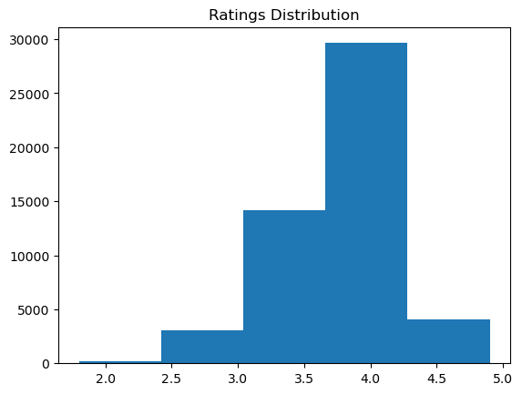
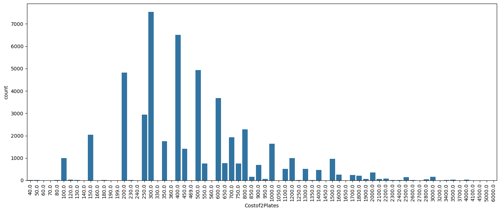
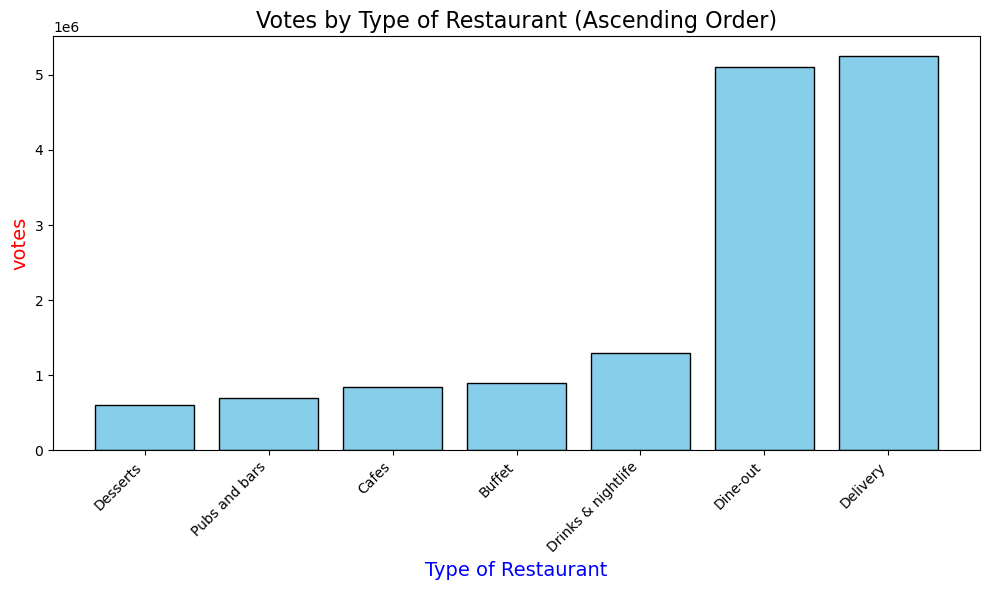

# Zomato Bangalore Data Cleaning & Exploratory Data Analysis

## 📌 Business Problem
Restaurant aggregators need insights into pricing, ratings, and customer behavior to improve market positioning and operational strategy.  
This project analyzes the Zomato Bangalore dataset to uncover actionable insights.

---

## 📊 Project Overview
This project demonstrates practical data cleaning, preprocessing, and exploratory data analysis (EDA) using Python.

The goal is to transform raw, messy restaurant data into meaningful business insights.

---

## 🛠 Tools & Technologies Used
- Python
- Pandas
- NumPy
- Matplotlib
- Seaborn
- Jupyter Notebook

---

## 🧹 Data Cleaning Steps
- Removed unnecessary columns
- Handled missing and inconsistent values
- Cleaned "rate" column (removed 'NEW', '-', '/5')
- Converted ratings to numeric format
- Removed duplicate records

---

## 📈 Exploratory Data Analysis
- Restaurant type distribution
- Online ordering trends
- Location-wise restaurant density
- Pricing distribution (Cost for Two)
- Rating distribution analysis

---

## 🔍 Key Business Insights
- Casual Dining and Quick Bites dominate the market
- Majority of restaurants fall in affordable to mid-range pricing
- Ratings mostly range between 3.5 and 4.2
- Commercial areas show highest restaurant density
- Strong adoption of online ordering services

---

## 📚 Dataset Source
Public Zomato Bangalore dataset (Kaggle).

---

## ▶ How to Run
1. Clone the repository
2. Open the notebook in Jupyter Notebook
3. Run all cells sequentially

---
## 📊 Sample Visualizations

### Ratings Distribution

### Cost for Two Distribution

### Restaurant Type Distribution

---

## 👨‍💻 Author
Praneeth Thanniru
